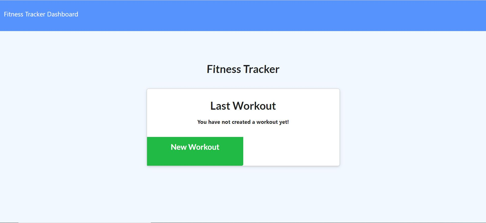
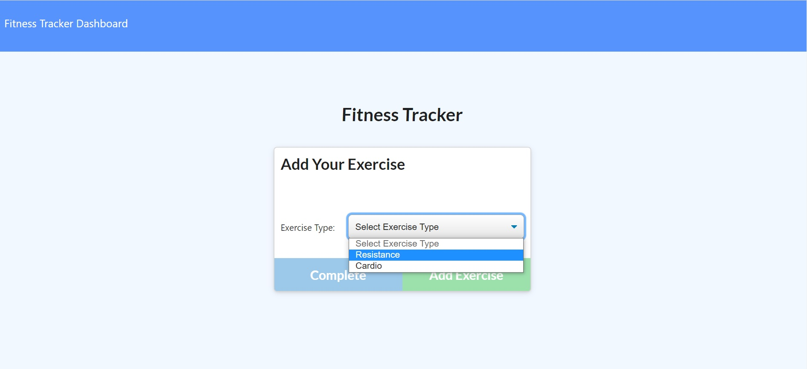
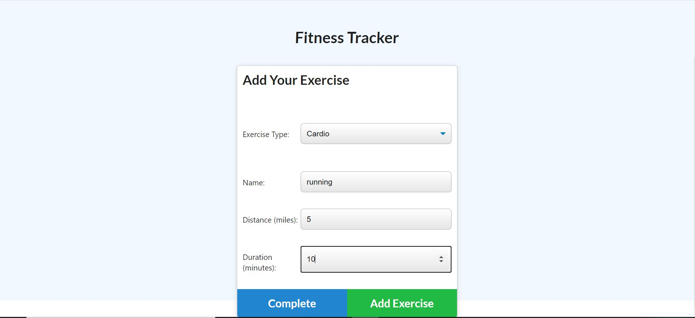

# FitnessTracker

## Overview

An application that allow users to create a workout plan and track their progress.

## Usage
 
To use the app, copy the link below to the browser and enter:

https://immense-basin-17479.herokuapp.com/

## How it works

Opening the app, users can choose to create a new workout

Users can choose between two types of workout, resistance or cardio.

Depends on the workout type, users can specify the exercise they want. Once done, click the "Add Exercise" To add the exercise to the workout. Users can add other exercises to the workout until they are satisfy, then click the "Complete" button to completely setup the workout

When users come back, the app will display the last workout they did. they can either continue the last workout by adding more exercises by clicking the "Continue Workout" button, or they can create a new workout by clicking the "New Workout" button. 

## Issue

There is currently no issue

## Technologies

## License

MIT